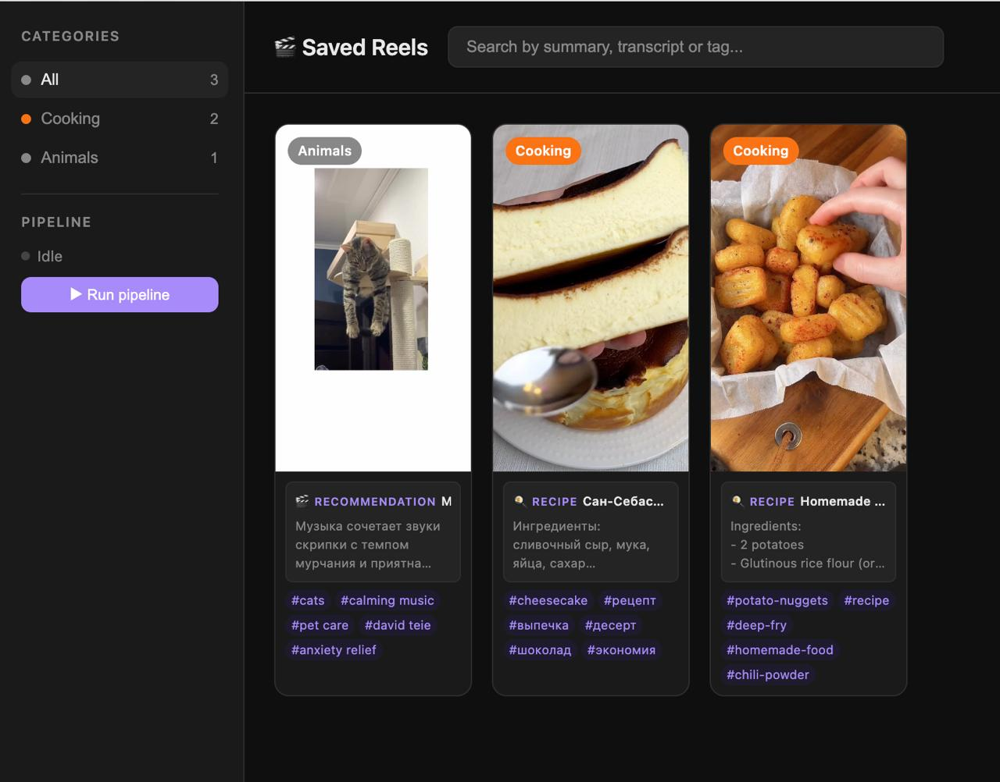

# Reelect

> Your saved Instagram Reels — transcribed, structured, and actually useful.
> Runs entirely on your machine. No cloud. No API keys. No cost per request.
> Works with any OpenAI-compatible LLM provider (LM Studio, OpenRouter, Ollama, etc.).

<!-- screenshot: main viewer grid with actionable cards -->


---

## The problem

You save a reel with a recipe, a useful app, a film recommendation. Three days later it's buried somewhere in your saved feed with no way to find it. Instagram's saved section has no search, no categories, no text — just an endless scroll of thumbnails.

Reelect fixes that.

---

## The main idea — Actionable content extraction

Most reels worth saving contain something concrete: a recipe, a step-by-step guide, a film to watch, a tool to try. Reelect listens to the audio, looks at the frames, and extracts that information into structured text you can actually read and use — without opening Instagram at all.

```
🍳 recipe      → ingredients + step-by-step instructions
📋 guide       → numbered steps, tips, how-to
🎬 recommendation → film / series / book + why it's worth it
🔗 resource    → app / website / tool + what it does
```

If a reel contains nothing actionable — just entertainment or opinion — it still gets a summary and tags, but no actionable block is generated.

### Example

A reel where someone talks about making a burnt basque cheesecake becomes:

```json
{
  "summary": "Рецепт сан-себастьяна без миксера за 40 минут.",
  "category": "cooking",
  "tags": ["cheesecake", "выпечка", "рецепт", "десерт"],
  "actionable": {
    "type": "recipe",
    "title": "Сан-Себастьян чизкейк",
    "content": "Ингредиенты: 600г сливочного сыра, 5 яиц, 200г сахара, 300мл сливок\n\n1. Смешать все ингредиенты венчиком\n2. Вылить в форму, застеленную бумагой\n3. Выпекать 30-40 мин при 220°C"
  }
}
```

The card in the viewer shows the recipe directly — no need to watch the video.

---

## How it works

```
Instagram Saved
      ↓
  download.sh      →  saved_videos/raw/instagram/<user>/<id>.mp4
                                            + <id>.transcript.txt  (Whisper cache)
                                            + <id>.visual.txt      (vision cache)
      ↓
  batch_analyze.py →  saved_videos/meta/<id>.json
                       { summary, category, tags, actionable }
      ↓
  viewer           →  http://localhost:8000
```

1. **Download** — fetches only new videos from your Instagram Saved via [gallery-dl](https://github.com/mikf/gallery-dl)
2. **Transcribe** — audio extracted with ffmpeg, transcribed locally with [faster-whisper](https://github.com/SYSTRAN/faster-whisper)
3. **Analyze** — frames sampled and sent alongside the transcript to a local vision LLM via [LM Studio](https://lmstudio.ai)
4. **Extract** — the LLM produces summary, category, tags, and actionable content in one pass
5. **View** — clean web UI with search, category filter, and live pipeline control

**Everything runs on your machine.** Audio is transcribed by Whisper locally. Video frames are analyzed by a local LLM via LM Studio. No data leaves your computer, no API keys required, no cost per video — just your hardware doing the work.

---

## Getting started

### 1. Prerequisites

- **Docker & Docker Compose**
- **[LM Studio](https://lmstudio.ai)** with a vision-capable model loaded, server running on port `1234`
- A `cookies.txt` exported from your browser while logged into Instagram
  - Install [Cookie-Editor](https://cookie-editor.com/), open instagram.com, export in **Netscape** format

### Choosing a model

Model selection is the most hardware-dependent part of the setup — there's no universal recommendation. A few guidelines:

| Hardware | What works |
|---|---|
| Apple Silicon (M1–M4) | Qwen2.5-VL-7B, Qwen3-8B, Gemma-3-12B |
| NVIDIA GPU (8 GB VRAM) | Qwen2.5-VL-7B-Instruct, Llama-3.2-11B-Vision |
| NVIDIA GPU (16 GB+ VRAM) | Qwen2.5-VL-32B, Llama-3.2-90B-Vision |
| CPU only | Keep it small: Qwen2.5-VL-3B or 7B with aggressive quantization (Q4) |

**What to look for:**
- The model must support **vision input** (image frames from the video)
- Bigger isn't always better — a well-quantized 7B often outperforms a bloated 32B that barely fits in VRAM
- If the model supports **thinking/reasoning** (Qwen3, DeepSeek-R1), set `LM_STUDIO_THINKING_BUDGET=512` to cap reasoning tokens and avoid the model spending all its token budget on thinking instead of the JSON output
- Set `LM_STUDIO_MAX_TOKENS_METADATA` high enough (8192+) for reasoning models — they consume tokens for thinking before writing the response

**Practical tip:** start with the smallest vision model that runs at a comfortable speed on your machine, then upgrade if the output quality isn't good enough.

### 2. Install

```bash
git clone https://github.com/your-username/reelect.git
cd reelect
cp .env.example .env
```

### 3. Configure `.env`

```
INSTAGRAM_USERNAME=your_handle

# For LM Studio (local):
LLM_BASE_URL=http://host.docker.internal:1234/v1
LLM_MODEL=qwen2.5-vl-7b-instruct

# For OpenRouter (cloud):
# LLM_BASE_URL=https://openrouter.ai/api/v1
# LLM_MODEL=qwen/qwen2.5-vl-7b-instruct
# LLM_API_KEY=sk-or-...

CRON_SCHEDULE="0 */12 * * *"
```

See `.env.example` for all options.

### 4. Run

> The first launch may take a while if you've saved many reels :)

```bash
docker compose build
docker compose up -d
```

Open [http://localhost:8000](http://localhost:8000).

The pipeline runs on schedule automatically. You can also trigger it manually from the UI with the **▶ Run pipeline** button.

---


## Configuration reference

| Variable | Default | Description |
|---|---|---|
| `INSTAGRAM_USERNAME` | — | Your Instagram handle |
| `CRON_SCHEDULE` | `0 */12 * * *` | Pipeline run schedule |
| `LLM_BASE_URL` | `http://host.docker.internal:1234/v1` | OpenAI-compatible endpoint (LM Studio, OpenRouter, Ollama, etc.) |
| `LLM_MODEL` | — | Model name (must match provider exactly) |
| `LLM_API_KEY` | — | Optional API key (only if provider requires auth) |
| `LLM_NATIVE_VIDEO` | `false` | Send full video to model instead of frames |
| `LLM_THINKING_BUDGET` | `512` | Reasoning token limit for thinking models |
| `LLM_MAX_TOKENS_VISUAL` | `4096` | Max tokens for visual description |
| `LLM_MAX_TOKENS_METADATA` | `8192` | Max tokens for metadata + actionable |
| `MAX_WORKERS` | `3` | Parallel whisper + ffmpeg workers |
| `LLM_CONCURRENCY` | `1` | Concurrent LLM requests |

---

## Notes

- `cookies.txt` and `.env` are gitignored and never committed.
- The Whisper model is baked into the Docker image — transcription is fully offline.
